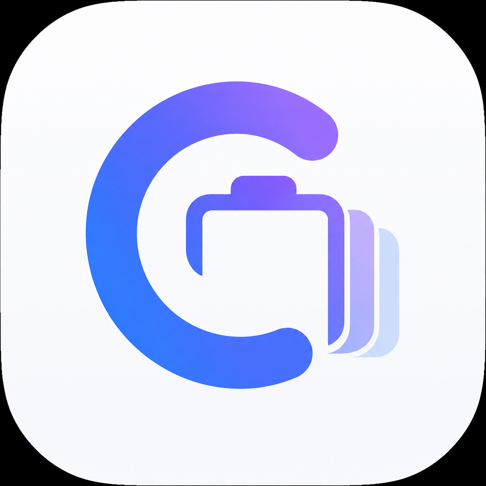

<p align="center">
  <picture>
    <source media="(prefers-color-scheme: dark)" srcset="ClipFlow/Resources/Assets.xcassets/ClipFlowLogoDark.imageset/logo-dark.png">
    <source media="(prefers-color-scheme: light)" srcset="ClipFlow/Resources/Assets.xcassets/ClipFlowLogoLight.imageset/logo-light.png">
    
  </picture>
</p>

<h1 align="center">ClipFlow</h1>

<p align="center">
  Premium clipboard manager for macOS.<br>
  Fast, minimal, native, and built for daily professional workflows.
</p>

<p align="center">
  <a href="https://github.com/richardfariax/clip-flow/releases/latest"></a>
  
  
</p>

## Why ClipFlow

ClipFlow gives you a `Windows + V` style clipboard history experience on macOS, with a polished floating panel, global hotkey access, and local-first privacy.

## Highlights

- Global hotkey to open the clipboard panel (`Option + V` by default)
- Preset shortcuts and custom shortcut recorder in Settings
- Clipboard history for text and images
- Search, favorite, pin, delete, and clear all
- Quick filters: All, Favorites, Pinned, Text, and Images
- Source app label on each clipboard record (when available)
- Filtered/total counter in panel header
- Selection auto-scroll while navigating with keyboard (`↑` and `↓`)
- Keyboard power actions inside panel:
  - `⌘1..⌘5` switch filters
  - `⌘D` favorite selected item
  - `⌘P` pin selected item
  - `⌘C` copy selected item back to clipboard
- Voice assistant with two activation modes:
  - Hotkey (`⌥⇧V`, default): mic turns on only while you speak — the macOS mic indicator stays off otherwise
  - Always listening with wake word (default `clipe`)
- Assistant commands: "que horas são", "que dia é hoje", "quantos graus agora" (free wttr.in, no API key), "abra o site github.com", "pesquise <termo>"
- Spoken responses via native macOS text-to-speech (offline) + system sound feedback — both optional
- Voice commands via native on-device speech recognition:
  - "clipe, abra o Xcode" / "clipe, open Xcode"
  - "clipe, tire um print" (full screen or area) — saved straight to history
  - "clipe, cole o item 2", "clipe, cole o último", "clipe, copie o item 3"
  - "clipe, digite <texto>" (voice dictation into the focused app)
  - "clipe, salve como deploy" / "clipe, cole o snippet deploy"
  - "clipe, formate o json", "clipe, limpar histórico", "clipe, pausar monitoramento"
  - Animated on-screen HUD with live transcript and command feedback
- Developer productivity tools:
  - Transform & copy from any card: format/minify JSON, Base64 encode/decode, camelCase/snake_case, UPPER/lower, trim
  - Smart content detection: JSON, hex colors, and hashes get their own icons
  - Named snippets (voice or context menu) with a dedicated Snippets filter (`⌘6`)
  - Sequential paste stack: queue items (`⌘S` or context menu) and paste them one by one
- Automatic paste back to the previously focused app
- Ignored app list for sensitive software (password managers, etc.)
- Optional local AES-GCM encryption
- Menu bar native app with light/dark support
- Launch at Login support

## Install (for end users)

### One-line install

```bash
curl -fsSL https://raw.githubusercontent.com/richardfariax/clip-flow/main/Scripts/install.sh | bash
```

This installs `ClipFlow.app` to `~/Applications` to avoid admin password prompts.

### Homebrew short command

One-time setup:

```bash
brew tap richardfariax/clip-flow https://github.com/richardfariax/clip-flow
```

Then install with the short command:

```bash
brew install --cask --appdir="$HOME/Applications" clipflow
```

### Homebrew (direct cask URL, no tap)

```bash
brew install --cask --appdir="$HOME/Applications" \
  https://raw.githubusercontent.com/richardfariax/clip-flow/main/Casks/clipflow.rb
```

Or run locally:

```bash
./Scripts/install_via_brew.sh
```

### DMG (manual)

1. Open [latest release](https://github.com/richardfariax/clip-flow/releases/latest).
2. Download `ClipFlow.dmg`.
3. Drag `ClipFlow.app` to `/Applications`.
4. Open ClipFlow and grant requested permissions.

Notes:

- If you install to `/Applications`, macOS may request admin password.
- If you install to `~/Applications`, admin password is usually not required.

## Permissions

ClipFlow may request:

- Accessibility: required for automatic paste simulation (`Cmd + V`)
- Input Monitoring: improves reliability for global hotkeys
- Microphone + Speech Recognition: required only if you enable voice commands (recognition runs on-device when available)
- Screen Recording: required for voice-triggered screenshots

These permission dialogs are controlled by macOS security and cannot be bypassed by the installer.

## For maintainers

```bash
./Scripts/version.sh status   # project.yml ↔ pbxproj ↔ git tag
./Scripts/version.sh bump 2.1.0
./Scripts/release.sh && ./Scripts/release_dmg.sh
```

Releases: merge `dev` → `main` runs semver (`feat`/`fix`/`feat!:`), tags, and uploads DMG/ZIP. Manual assets: `.github/workflows/release-assets.yml`. Cask: `Casks/clipflow.rb`.

## Privacy

ClipFlow stores data locally on your Mac.
No cloud sync is enabled by default.

## Credits

Developed by Richard Farias

- LinkedIn: https://www.linkedin.com/in/richardfariasss/
